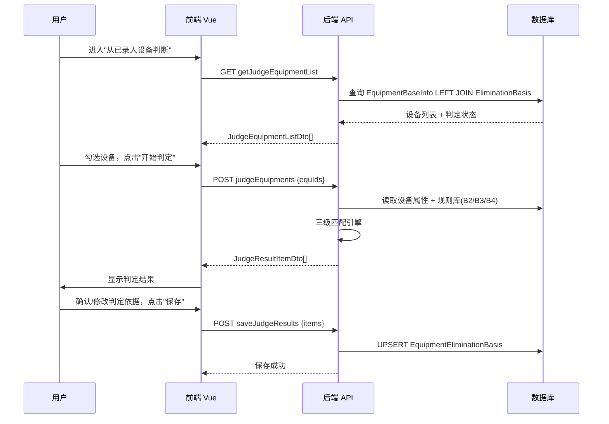

# 低效淘汰设备判断功能 —— "从已录入设备判断"实施计划

## 背景

当前前端的判定功能（`FromExisting.vue`、`JudgeRunner.vue`、`JudgeResult.vue`）使用**本地静态数据 + 前端 JS 判定引擎**进行演示。现需要将其改造为**前后端联动的真实业务流程**：

1. 设备列表从后端 API 读取（`EquipmentBaseInfo` + `EquipmentEliminationBasis` LEFT JOIN）
2. 判定逻辑在后端 C# 中实现（遍历规则库 B2/B3/B4 进行三级匹配）
3. 判定结果可由用户确认/修改后保存至 `T_ST_EquipmentEliminationBasis` 表

---

## User Review Required

> [!IMPORTANT]
> **设备属性取值查询方式**：当前 `EquipmentDataDbContext` 中未注册 `EquipmentBaseInfo`、`EquipmentAttributeValue`、`EquipmentEliminationBasis` 三个 DbSet。计划在 DbContext 中新增这三个 DbSet 并配置 Fluent API（特别是 `EquipmentAttributeValue` 的联合主键）。请确认是否同意修改 `EquipmentDataDbContext`。
同意修改

> [!IMPORTANT]
> **设备型号字段**：设备主表 `EquipmentBaseInfo` 中没有直接的"型号"字段，型号信息存储在属性取值表中（属性ID=8 为品牌，需确认哪个属性ID存储型号）。从现有的 `EquipmentAttributeDict` 来看，没有一个属性明确叫"型号"。而前端演示数据中的 `model` 字段（如 `Y225M-4`）应该是设备的品牌+型号信息。请确认：
> - 设备型号是否存储在属性ID=8（品牌）中？
> - 或者是否有其他来源？
> - 如果不确定，我将在查询时从属性ID=8读取品牌信息作为型号匹配依据。
ID=22是型号，建议有一个属性对应保存id，方便修改

> [!WARNING]
> **判定逻辑中的规格参数映射**：规则库 B4 表中的参数名（如"功率"、"电压"）需要与设备属性字典中的属性名（如"额定功率(kW)"、属性ID=10）进行模糊匹配。计划采用**包含子串**的方式进行映射（如 `"额定功率(kW)".Contains("功率")`）。
可以，但是判定规则希望单独写一个方法，这样后期方便替换
---

## Open Questions

> [!IMPORTANT]
> 1. 设备属性中哪个属性ID存储了"设备型号"信息？（属性ID=8 是"品牌"，但需要的是型号如 `Y225M-4`）
> 2. 属性ID=7 是"设备启用时间（年份）"，用作投运年份是否正确？
> 3. 属性ID=39 是"出厂日期"，是否用于年份约束判定？还是用属性ID=7？

---

## Proposed Changes

### 组件一：数据库层 (SQLEFCore)

#### [MODIFY] [EquipmentDataDbContext.cs](file:///d:/TFS2015/TTBEMSCore/TTBEMSCommanLibrary/SQLEFCore/SQLEFCore/DataContext/EquipmentDataDbContext.cs)
- 新增 `DbSet<EquipmentBaseInfo>`、`DbSet<EquipmentAttributeValue>`、`DbSet<EquipmentEliminationBasis>` 三个 DbSet
- 在 `OnModelCreating` 中配置 `EquipmentAttributeValue` 的联合主键（F_EquID + F_BuildID + F_EquAttributeID）
- 新增对应的 Fluent API 配置类

---

### 组件二：后端视图模型 (Models/View/Equipment)

#### [NEW] [JudgeDto.cs](file:///d:/TFS2015/TTBEMSCore/HuangPuProject/HuangPuProject/HuangPuCarbonManagementAPI/Models/View/Equipment/JudgeDto.cs)

新建判定功能相关的 DTO 类：

| 类名 | 说明 |
|------|------|
| `JudgeEquipmentListDto` | 判定设备列表项（含设备基本信息 + 判定状态 + 关键属性） |
| `JudgeEquipmentQueryInput` | 查询参数（建筑ID、判定状态筛选、分页） |
| `JudgeRequestDto` | 判定请求（设备ID列表） |
| `JudgeResultItemDto` | 单台设备的判定结果（含命中规则列表、判定状态、匹配细节） |
| `JudgeHitDto` | 命中的单条规则详情 |
| `JudgeSaveRequestDto` | 保存判定结果请求（含用户修改后的判定依据列表） |
| `JudgeSaveItemDto` | 单条保存项（设备ID + 规则ID + 淘汰类型 + 匹配方法 + 判定依据 + 备注） |

---

### 组件三：后端服务层 (Services)

#### [MODIFY] [EquipmentService.cs](file:///d:/TFS2015/TTBEMSCore/HuangPuProject/HuangPuProject/HuangPuCarbonManagementAPI/Services/EquipmentService.cs)

新增以下方法：

| 方法 | 说明 |
|------|------|
| `GetJudgeEquipmentListAsync(query)` | 查询设备列表（LEFT JOIN 判定表，标记已判定/未判定），支持分页和筛选 |
| `JudgeEquipmentsAsync(equIds)` | **核心判定逻辑**：批量接收设备ID，遍历规则库进行三级匹配，返回判定结果 |
| `SaveJudgeResultsAsync(items)` | 保存/更新判定结果至 `EquipmentEliminationBasis` 表 |

**判定引擎核心流程**（`JudgeEquipmentsAsync`）：
```
对每台设备：
  1. 读取设备基本信息（主表 + 属性值表中的型号、功率、电压、启用年份等关键属性）
  2. 遍历所有启用状态的淘汰规则（B2表，State=1）：
     a. 型号匹配（一级）：读取该规则关联的型号清单（B3表），按前缀/精确模式匹配设备型号
     b. 规格匹配（二级）：读取该规则关联的规格区间（B4表），比对设备参数值
     c. 年份约束（三级）：解析规则的 ProductionYearConstraint 字段，比对设备出厂/启用年份
  3. 汇总命中规则，确定判定状态（强制淘汰 > 限期淘汰 > 正常）
```

---

### 组件四：后端控制器 (Controllers)

#### [MODIFY] [EquipmentController.cs](file:///d:/TFS2015/TTBEMSCore/HuangPuProject/HuangPuProject/HuangPuCarbonManagementAPI/Controllers/EquipmentController.cs)

在 `#region 判定逻辑` 区域新增 3 个接口：

| 路由 | 方法 | 说明 |
|------|------|------|
| `GET getJudgeEquipmentList` | `GetJudgeEquipmentListAsync` | 获取待判定/已判定设备列表 |
| `POST judgeEquipments` | `JudgeEquipmentsAsync` | 执行批量判定 |
| `POST saveJudgeResults` | `SaveJudgeResultsAsync` | 保存判定结果 |

---

### 组件五：前端 API 层 (api/)

#### [NEW] [judge.js](file:///d:/Git/github/Equ_Base_Info/src/api/judge.js)

新建判定专用 API 模块，对接后端三个接口，同时保留 `USE_MOCK` 兜底机制：

| 函数 | 说明 |
|------|------|
| `getJudgeEquipmentList(query)` | 获取设备列表（分页 + 状态筛选） |
| `judgeEquipments(equIds)` | 发起判定 |
| `saveJudgeResults(items)` | 保存判定结果 |

---

### 组件六：前端页面改造 (components/judge/)

#### [MODIFY] [FromExisting.vue](file:///d:/Git/github/Equ_Base_Info/src/components/judge/FromExisting.vue)

**核心改造**：从静态数据 → 后端 API 驱动

- 移除 `import { SAMPLE_DEVICES }` 静态数据引用
- 新增 `onMounted` 调用 `getJudgeEquipmentList` API 获取设备列表
- 新增查询筛选区域（按判定状态筛选：全部/未判定/已判定）
- 新增分页组件
- 设备列表展示适配后端 DTO 字段（equId、equipmentName、typeName、model、year、judgeStatus 等）
- 点击"开始判定"时 emit 设备 ID 列表（而非完整设备对象）

#### [MODIFY] [JudgeView.vue](file:///d:/Git/github/Equ_Base_Info/src/components/judge/JudgeView.vue)

- 移除本地规则库 `RULES_LIB_INIT` 引用
- `startJudge` 流程改为调用后端 `judgeEquipments` API
- 调整状态机流程：`from-existing → 调用API判定中(loading) → result`
- 判定过程使用 loading 状态展示（不再走前端 JudgeRunner 步骤动画）

#### [MODIFY] [JudgeResult.vue](file:///d:/Git/github/Equ_Base_Info/src/components/judge/JudgeResult.vue)

- 适配后端返回的 `JudgeResultItemDto` 数据结构
- 新增"确认/修改判定依据"功能：用户可编辑每条判定记录的 `judgmentCriteria`（判定依据）和 `desc`（备注）
- 新增"保存判定结果"按钮，调用 `saveJudgeResults` API

---

## 数据流示意



---

## Verification Plan

### Automated Tests
- 后端编译验证：`dotnet build` 确保后端项目编译通过
- 前端编译验证：`npm run dev` 确保前端无编译错误

### Manual Verification
1. 前端页面打开"从已录入设备判断"，验证设备列表正确加载（Mock 模式下使用静态数据兜底）
2. 勾选设备执行判定，验证判定结果展示正常
3. 确认/修改判定依据后保存，验证保存接口调用正确
4. 后端接口通过 Swagger 单独测试三个新接口的入参/返回格式
